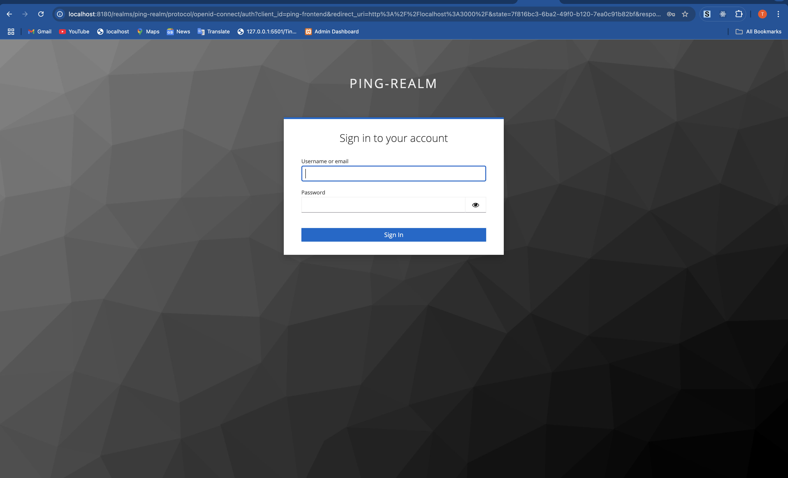
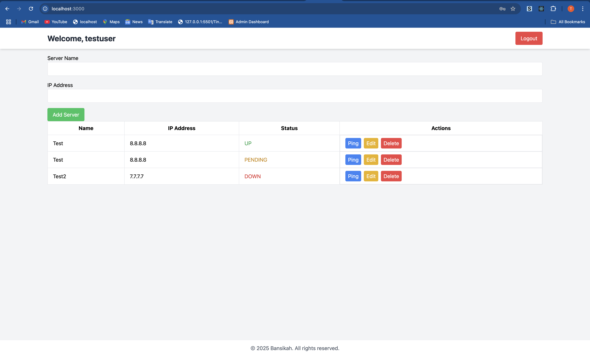

# Helm Chart for Kubernetes Deployment

A Helm chart for deploying the Ping Server Application using the bjw-s common library will be created in `helm/ping-server-app`.

# Ping Server Application

This project is a full-stack application that allows users to authenticate via Keycloak and manage servers through a REST API, with a React frontend, Spring Boot backend, and PostgreSQL database, all orchestrated using Docker Compose.

This project is purposely built to help newbies getting started with spring boot and keycloak, did this for my article

## Prerequisites
- Maven
- Java 17+
- Node
- Docker
- Docker Compose
- Basics on springboot, node and keycloak

## Running project locally
### Clone Project 
```bash
https://github.com/bansikah22/ping-server-application

## cd into project
cd ping-server-application
```
### Start backend
```bash
cd backend
mvn clean install
mvn spring-boot:run
```
### Start frontend
```bash
cd frontend
npm install
npm start
```

### Run project with docker compose
At the root of the project run:
```bash
docker-compose up -d --build
```
You see this below , use the test user creds

Test User:
```bash
Username: testuser
Password: password
```
and after login you will see 


## Contribute
Contributions are welcome or any error during the set up process you can create a ticket or if you saw a better way of doing things you can create an issue or work on it and create a PR and i will look at it Thank you and hope this helps 😊

## License
This project is License under the [Apache 2.0](./LICENSE)