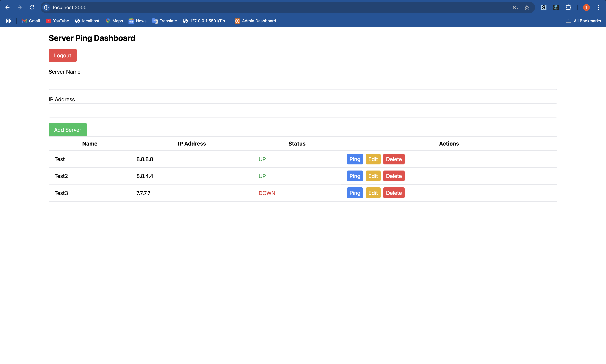

# Ping Server Application

This project is a full-stack application that allows users to authenticate via Keycloak and manage servers through a REST API, with a React frontend, Spring Boot backend, and PostgreSQL database, all orchestrated using Docker Compose.

### Run project with docker compose
```bash
docker-compose up -d --build
```
You see this below , use the test user creds

Test User:
```bash
Username: testuser
Password: password
```
and after login you will see 

[LICENSE](./LICENSE)